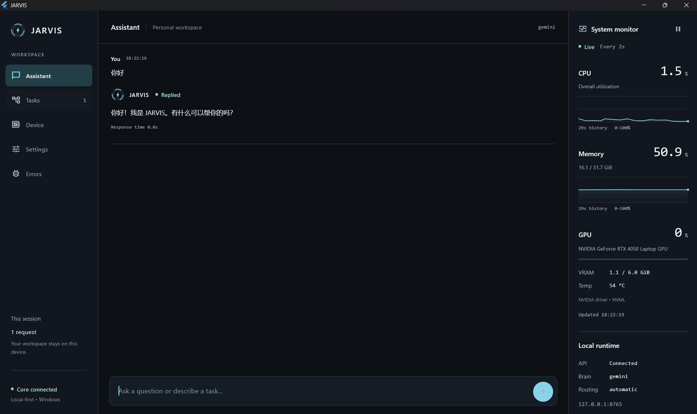
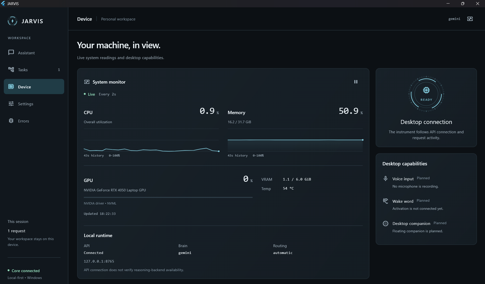

# JARVIS Local AI Assistant

JARVIS is an open-source, local-first Windows desktop foundation with a native
Flutter app, a loopback API, policy-controlled local tools, and live hardware
monitoring. It is not yet a general-purpose chat assistant.

Use the Desktop app to watch live CPU, memory, and NVIDIA GPU readings. Its
local API exposes explicit, safe project/system operations for integrations.
Once built, launch it from a desktop icon without opening a terminal or
recompiling the app.

JARVIS does not load a local language model and does not use a GPT API. General
natural-language reasoning, ChatGPT UI delegation, and Codex delegation are not
implemented yet. Python policy—not an AI prompt alone—governs the local tools
and the existing Open Interpreter integration.

**Status:** working desktop/API/telemetry foundation, under active development.
Free-form task chat, voice, wake word, a desktop companion, and persistent
history are not implemented.

[Screenshots](#desktop-preview) · [Installation](#installation) ·
[Features](#current-features) · [Security](#security-model) ·
[Implementation plan](docs/chatgpt-codex-implementation-plan.md) ·
[Desktop guide](desktop_ui/README.md)

## Desktop Preview

### Assistant workspace

Chat with JARVIS, review tool results, and keep live system readings alongside
the conversation. The compact composer grows as you type.



### Device dashboard

CPU and memory history, NVIDIA GPU utilization, VRAM, temperature, and local API
status. Desktop capabilities that are not connected yet are explicitly marked
**Planned**.



Screenshots captured on Windows on September 3, 2026. Hardware readings and
response times are examples from that session, not performance benchmarks.

---

## Current Features

### Native Windows Desktop

| Page | Available now |
| --- | --- |
| Assistant | Chat UI shell, local greeting replies, pending Open Interpreter confirmation replies, and a system-monitor side panel on wider windows. Free-form requests are not executed yet. |
| Tasks | Requests and results from the current UI session. |
| Device | Live CPU, memory, NVIDIA GPU, and local runtime status. |
| Settings | Session-only appearance and brain/routing information is read-only. |
| Errors | Session-only diagnostics, occurrence counts, error details, copy, and confirmed clear. |

- Steel/cyan interface with responsive layouts and shared visual components.
- Desktop shortcut that starts or reuses the local API and opens the Release app.
- Ctrl+Enter sends; two consecutive Enter presses within 600 ms also send.
  Shift+Enter inserts a newline, and active IME composition is protected.
- UI errors use a compact notice and a dedicated Errors page instead of a large
  red Flutter error panel. Command-line and IDE diagnostics are preserved.

The desktop app uses the same Core tools and routing policy as the CLI.
Conversation history, the UI task list, error reports, and UI preferences are
not yet persisted across app sessions. See the [desktop guide](desktop_ui/README.md)
for detailed behavior and limits.

### What Works Now / 现在能做什么

- **Desktop monitoring / 桌面监控:** the Device page and Assistant side panel
  poll the local API for CPU utilisation, physical memory, and supported NVIDIA
  GPU metrics. This does not need an AI backend.
- **Local API / 本地 API:** explicit endpoints provide system information,
  project listing, registered-project Git status, file listing, file reading,
  file search, and a user-requested project-registry refresh.
- **Native Python tools / 原生 Python 工具:** the Core contains application
  discovery/opening, system information, project discovery, Git status, and
  registered-project read-only file tools. For example, `open_app("Chrome")`
  finds a Start Menu shortcut and opens it. These are callable through explicit
  Core/API interfaces, not inferred from arbitrary chat text.
- **Open Interpreter safety foundation / 安全基础:** workspace validation,
  manual/ask/automatic modes, risk classification, confirmation, task records,
  and notifications are implemented. When explicitly invoked through the
  router and available on PATH, it can run a bounded local task such as opening
  an application; the Desktop chat does not yet create a new Open Interpreter
  task from free-form text.
- **Chat / 聊天:** exact greetings such as `hello` and `你好` receive a local
  reply. The chat endpoint also accepts `yes`/`no` only for an Open Interpreter
  task that was already created through an explicit interface.
- **Desktop startup / 桌面启动:** the provided shortcut starts or reuses the
  loopback API, opens the Release UI, and stops only the API instance it started
  when that window closes.

### Not Available Yet / 现在还不能做

- A free-form message such as “Show my current CPU and memory usage” or “打开
  Chrome” is **not** routed to a native/Open Interpreter tool from the chat
  composer yet. Open Device or the Assistant side panel to view telemetry;
  Chrome requires an explicit native/Open Interpreter caller today.
- Codex, ChatGPT UI, and automatic natural-language tool selection are not
  configured. JARVIS deliberately returns an unavailable message instead of
  pretending that work was completed.
- No Ollama, Qwen, other local model, GPT API, automatic browser control,
  unrestricted PowerShell, file-writing chat workflow, or autonomous computer
  control is available.

The intended, not-yet-implemented direction is documented in the bilingual
[implementation plan](docs/chatgpt-codex-implementation-plan.md).

### Current Chat Boundary / 当前聊天边界

The Assistant composer is present, but it is not connected to a reasoning
executor. It cannot currently infer that “Show my current CPU and memory usage”
should call a local tool. That is why the screenshot receives the Codex-not-
configured response even while the CPU/RAM panel is capable of showing live
data. This is an intentional migration boundary, not a telemetry failure.

### Native Application Discovery

JARVIS can automatically discover many installed Windows applications through Start Menu shortcuts.

Current capabilities include:

- Scan Windows Start Menu applications
- Generate a local application registry
- Exact application-name matching
- Partial application-name matching
- Fuzzy application-name matching
- Automatically refresh the registry when an application is not found

Examples for an explicit native-tool caller:

```text
打开 Chrome
```

```text
打开 Visual Studio Code
```

```text
打开 Spotify
```

The application registry is generated locally and should not be committed to Git.

### Live System Monitoring

The desktop reads actual system counters through the local API; monitoring
does not call the language model or create tasks.

- CPU utilization and physical memory usage, with bounded history charts.
- NVIDIA GPU utilization, used/total VRAM, and temperature through NVML.
- Updates every 2 seconds by default, with 2 / 5 / 10 second intervals and pause.
- Polling pauses while the app is minimized; requests do not overlap.
- Unsupported GPU metrics show N/A. AMD/Intel GPU monitoring is not implemented.

The chat composer does not currently route CPU/RAM questions to this API.
Monitoring is lightweight but not free; pause it or use a slower interval on
battery power.

Example:

```text
我的 CPU 和 RAM 现在用了多少？
```

### Automatic Project Discovery

JARVIS can scan configured development directories and automatically discover software projects.

Project scanning is restricted to configured project roots.

Example local configuration:

```json
{
  "roots": [
    "C:\\Users\\YOUR_USERNAME\\GitHub",
    "C:\\Users\\YOUR_USERNAME\\Documents\\GitHub"
  ]
}
```

Current framework detection includes:

- Laravel
- PHP
- Django
- Python
- Node.js
- Java Maven
- Java Gradle
- Git repositories

Example command:

```text
重新扫描我的 project
```

### Project Management

Current project capabilities:

- Refresh the project registry
- List discovered projects
- Get project information
- Detect project framework
- Detect whether a project uses Git
- Check whether the project path exists
- Open projects in Visual Studio Code

Example commands:

```text
我有哪些 project？
```

```text
告诉我 FYP 的资料
```

```text
打开 FYP
```

### Git Integration

Current Git capabilities:

- Check Git status
- Detect the current branch
- Detect modified files
- Detect untracked files

Example:

```text
检查 FYP 的 Git status
```

### Read-Only Project File Tools

JARVIS currently provides read-only project file access.

It can:

- List project files and folders
- Read supported text files
- Search project source code
- Search keywords
- Search classes
- Search functions
- Search routes
- Search models

Example commands:

```text
看看 FYP 根目录有什么文件
```

```text
读取 FYP 的 composer.json
```

```text
在 FYP 里面搜索 RoomController
```

### Project Path Protection

Project file tools are restricted to registered project directories.

Requests attempting to escape a registered project directory should be rejected.

Example:

```text
../../Windows/System32
```

should not be allowed to expose files outside the registered project.

### Open Interpreter Routing

Open Interpreter is an optional execution backend for complex local workflows
that are not covered by JARVIS native tools. JARVIS keeps routing and safety
policy in `services/task_router.py`.

Current routing modes:

- `manual`: Open Interpreter runs only when the user explicitly requests it.
- `ask`: JARVIS requests confirmation before non-explicit delegation.
- `automatic`: low-risk read-only tasks may run directly; medium-risk and
  high-risk tasks require confirmation.

Open Interpreter always requires an explicit existing subdirectory as its
workspace. Current directories, drive roots, and missing directories are
rejected. Pending requests can be confirmed or cancelled before execution.

### Development Auto-Reload

JARVIS includes a development workflow using `watchfiles`.

Run:

```powershell
.\dev.ps1
```

During development:

```text
Modify Python code
  ↓
Save file
  ↓
watchfiles detects the change
  ↓
JARVIS automatically restarts
  ↓
Updated code is loaded
```

This avoids manually restarting JARVIS after every code change.

---

## Architecture

The Flutter desktop connects to `app/api.py` on `127.0.0.1:8765`. The FastAPI
service and terminal CLI reuse the same Core tool registry and
`services/task_router.py` policy. System telemetry is a separate read-only API
path and does not enter a reasoning flow.

Core tool flow:

```text
                         User
                          │
                          ▼
              Codex executor (planned)
                          │
                          ▼
                  Action proposal
                          │
                          ▼
                     Tool Router
                          │
        ┌─────────────────┼─────────────────┐
        ▼                 ▼                 ▼
     System            Projects            Git
     Skills             Skills            Skills
        │                 │                 │
        └─────────────────┼─────────────────┘
                          ▼
                       Files
                       Skills
                          │
                          ▼
                       Services
                          │
             ┌────────────┴────────────┐
             ▼                         ▼
       App Registry              Project Registry
             │                         │
             ▼                         ▼
    Windows Start Menu         Configured Scan Roots
             │                         │
             ▼                         ▼
   Installed Applications      Development Projects
```

The language model decides which registered tool is appropriate.

The JARVIS engine controls what tools actually exist and how those tools execute.

---

## Project Structure

```text
JARVIS_Local_AI/
├── app/
│   ├── main.py                 # Core conversation loop and CLI
│   ├── api.py                  # Loopback API for the desktop
│   └── desktop_launcher.py     # Windowless Release-app launcher
│
├── desktop_ui/                 # Flutter Windows app and widget tests
├── docs/
│   └── screenshots/            # README screenshots
│
├── config/
│   ├── apps.example.json
│   ├── project_roots.example.json
│   └── projects.example.json
│
├── memory/
│   └── __init__.py
│
├── services/
│   ├── __init__.py
│   ├── app_registry.py
│   ├── notification_service.py
│   ├── project_registry.py
│   ├── task_manager.py
│   ├── task_router.py
│   ├── system_telemetry.py
│   └── agents/
│       └── open_interpreter.py
│
├── skills/
│   ├── files.py
│   ├── git.py
│   ├── project.py
│   └── system.py
│
├── tests/
│
├── .gitignore
├── dev.ps1
├── run-desktop.ps1
├── create-desktop-shortcut.ps1
├── LICENSE
├── README.md
└── requirements.txt
```

Generated local configuration files such as `apps.json`, `projects.json`, and `project_roots.json` should remain local.

---

## Requirements

For the Windows desktop source build:

- Windows 11 (current development platform)
- Python 3 with pip
- Git
- Flutter SDK; the current build uses Flutter 3.44.9 / Dart 3.12.2
- Visual Studio with the **Desktop development with C++** workload, not just
  Visual Studio Code; see [Flutter's Windows setup guide](https://docs.flutter.dev/platform-integration/windows/setup)

The launch script currently expects Flutter at
`C:\Flutter-3.44.9\flutter\bin\flutter.bat`. If your SDK lives elsewhere, update
the `$Flutter` path in [run-desktop.ps1](run-desktop.ps1) before building.
The Dart SDK constraint is declared in [desktop_ui/pubspec.yaml](desktop_ui/pubspec.yaml).

NVIDIA hardware and a working driver are needed for NVIDIA-specific telemetry,
not for displaying the desktop shell. Available GPU metrics depend on the device.

---

## Installation

### 1. Clone the repository

Run these commands in PowerShell. All later commands start from the repository root.

```powershell
git clone https://github.com/Justin11-13/JARVIS_Local_AI.git
cd JARVIS_Local_AI
```

### 2. Create the Python environment

```powershell
python -m venv .venv
.\.venv\Scripts\python.exe -m pip install -r requirements.txt
```

The commands use the virtual environment directly; activation is optional.

### 3. Configure project scan roots (optional)

For project tools, create a local configuration without replacing an existing one:

```powershell
if (-not (Test-Path config\project_roots.json)) {
    Copy-Item config\project_roots.example.json config\project_roots.json
}
```

Then edit:

```text
config/project_roots.json
```

Example:

```json
{
  "roots": [
    "C:\\Users\\YOUR_USERNAME\\GitHub",
    "C:\\Users\\YOUR_USERNAME\\Documents\\GitHub"
  ]
}
```

JARVIS only scans directories configured here.

To manually register projects, you can also use
[config/projects.example.json](config/projects.example.json) as a template:

```powershell
if (-not (Test-Path config\projects.json)) {
    Copy-Item config\projects.example.json config\projects.json
}
```

Local project configuration should not be committed.

### 5. Build the desktop app and create its shortcut

Complete the [Flutter Windows toolchain setup](https://docs.flutter.dev/platform-integration/windows/setup),
then check it and build:

```powershell
& "C:\Flutter-3.44.9\flutter\bin\flutter.bat" doctor -v
.\run-desktop.ps1 -BuildOnly -Release
.\create-desktop-shortcut.ps1
```

If your SDK path differs, use that path for `doctor` and update the launcher as
described in [Requirements](#requirements). Resolve Windows/Visual Studio toolchain
errors before building.

Double-click **JARVIS** on your Windows desktop. The shortcut uses the compiled
Release app: no terminal, dependency download, or Flutter compilation on each
launch. It starts the local API when needed and waits for it to become ready.

The first build downloads locked Flutter dependencies into the ignored
`.pub-cache/` inside this repository; the shared AppData cache is not modified.
Keep the repository, virtual environment, and complete build folder in place.
The shortcut is not a standalone installer, and the executable needs its nearby
DLLs and `data/` directory.

### Other ways to run

For Flutter development, including the usual build/run output:

```powershell
.\run-desktop.ps1
```

For the terminal-only assistant:

```powershell
.\.venv\Scripts\python.exe -m app.main
```

The older `ui.desktop_app` Tkinter prototype is retained as a reference, not the
preferred desktop UI.

### Updating and troubleshooting

- **Flutter source changed:** close the Release app and rerun
  `.\run-desktop.ps1 -BuildOnly -Release`. The existing shortcut will open the
  updated build.
- **Python backend changed:** restart the existing JARVIS API; opening another
  desktop window does not reload a running backend.
- **Shortcut cannot start:** check the error dialog and `tmp/desktop-startup.log`.
  For build diagnostics, run `.\run-desktop.ps1 -BuildOnly` in PowerShell.
- **API connected, reasoning unavailable:** configure the Codex executor when
  that migration phase is complete.

When the shortcut starts the API, closing that desktop window stops the API too.
An API that was already running is reused and is not stopped by this shortcut.
The shortcut does not add Windows login startup or a keyboard hotkey. More details are in the
[desktop guide](desktop_ui/README.md).

---

## Development Mode

The **terminal CLI** supports automatic restart during development. This does
not hot-reload the separate desktop API process.

### Install `watchfiles`

```powershell
.\.venv\Scripts\python.exe -m pip install watchfiles
```

### Start development mode

```powershell
.\dev.ps1
```

When Python source files change, JARVIS will automatically restart and load the updated code.

For normal desktop usage, use the **JARVIS** desktop shortcut. To run the CLI
without auto-reload:

```powershell
.\.venv\Scripts\python.exe -m app.main
```

### Verification

Backend tests and a Windows dependency/build check, from the repository root:

```powershell
.\.venv\Scripts\python.exe -m unittest discover -s tests
.\run-desktop.ps1 -BuildOnly
```

To run Flutter analysis and widget tests with the same project-local cache:

```powershell
$env:PUB_CACHE = Join-Path $PWD ".pub-cache"
$FlutterSdk = "C:\Flutter-3.44.9\flutter\bin\flutter.bat"
Push-Location desktop_ui
try {
    & $FlutterSdk pub get --enforce-lockfile
    & $FlutterSdk analyze --no-pub
    & $FlutterSdk test --no-pub
} finally {
    Pop-Location
}
```

Use your actual Flutter path if different. These commands do not install a
shortcut or launch the UI; the `PUB_CACHE` assignment applies to this shell.

---

## Example Commands

### Applications

```text
打开 Chrome
```

```text
打开 Spotify
```

```text
打开 Visual Studio Code
```

### System

```text
我的 CPU 和 RAM 现在用了多少？
```

### Project Discovery

```text
重新扫描我的 project
```

### Projects

```text
我有哪些 project？
```

```text
告诉我 FYP 的资料
```

```text
打开 FYP
```

### Multi-Step Request

```text
打开 FYP，然后检查它的 Git status
```

### Files

```text
看看 FYP 根目录有什么文件
```

```text
读取 FYP 的 composer.json
```

```text
在 FYP 里面搜索 RoomController
```

---

## Security Model

JARVIS uses allow-listed native tools and Python-enforced routing decisions.

The normal native-tool path does not expose arbitrary shell execution to the
model. The optional Open Interpreter adapter is a separate dynamic executor;
review its workspace, requested work, and confirmation carefully.

### Currently Allowed

- Open discovered applications
- Read CPU usage
- Read RAM usage
- Read NVIDIA GPU telemetry through the desktop API
- Discover projects from configured roots
- List discovered projects
- Read project metadata
- Open projects
- Read Git status
- List project files
- Read project files
- Search project source code

### Native Tool Restrictions

Native tools do not provide:

- Arbitrary PowerShell execution
- Arbitrary shell execution
- File deletion
- File modification
- Code modification
- Git commit
- Git push
- System configuration changes
- Administrator-level system operations

Open Interpreter can perform broader local work when its routing policy allows
it. In automatic mode, low-risk work may proceed directly; medium/high-risk
work requires confirmation. Risk classification currently uses keyword rules,
not a complete operating-system sandbox. Workspace validation and confirmation
are safeguards, not a guarantee that arbitrary generated code is safe.

The desktop API binds to loopback when launched by the supplied scripts. Do not
expose it to a network. The full permission/trust model described below remains
planned, including dedicated native write and Git commit/push approval flows.

---

## Local Configuration

The following files should remain local and should not be committed:

```text
.venv/
.pub-cache/
desktop_ui/build/
desktop_ui/.dart_tool/
tmp/
.env
config/apps.json
config/projects.json
config/project_roots.json
__pycache__/
*.pyc
*.db
*.sqlite
*.sqlite3
```

Use example configuration files instead:

```text
config/apps.example.json
config/projects.example.json
config/project_roots.example.json
```

---

## Development Status

JARVIS is an experimental Windows desktop assistant with a working Flutter UI,
loopback API, native/read-only project tools, live telemetry, and guarded Open
Interpreter delegation. Its former local-model loop has been removed. The
ChatGPT UI and Codex executors remain planned integrations.

The current product foundation includes the desktop shortcut, Assistant / Tasks /
Device / Settings / Errors pages, and session-only diagnostics. Voice input,
wake word, a desktop companion, persistent history, system tray integration,
and editable model/routing configuration are still planned.

It is not yet intended to provide unrestricted autonomous control of a computer.

---

## Product Master Plan

This section is a short product overview. The authoritative delivery sequence
is the bilingual [ChatGPT UI + Codex implementation plan](docs/chatgpt-codex-implementation-plan.md).
A feature marked **Planned** is not available yet. Existing features remain
deliberately conservative while the broader permission system is built.

### Product Vision

JARVIS is intended to become a local-first personal Windows AI assistant:
not only a chatbot, but a system that can understand a request, select a safe
executor, observe the result, continue when appropriate, and notify the user.

~~~text
User
 ↓
Understand intent
 ↓
Choose tool or agent
 ↓
Check policy and permission
 ↓
Execute
 ↓
Observe result
 ↓
Notify user
~~~

### Product Architecture

~~~text
                         JARVIS
                            │
          ┌─────────────────┼──────────────────┐
          │                 │                  │
   Voice Interface     JARVIS Brain       Desktop UI
          │                 │                  │
    Wake word / STT     Intent / Router      Settings
          │                 │                  │
          └──────────── TaskRouter ───────────┘
                            │
        ┌───────────────────┼───────────────────┐
        ▼                   ▼                   ▼
  Python / PowerShell    ChatGPT UI        Specialist Executors
  Native small tasks       + Codex          Open Interpreter (on demand)
                            │
                      Permission Layer
                            │
                      Task Execution
                            │
                  Monitor and Notification
~~~

**Implemented foundation:** native tools, TaskRouter, TaskManager, terminal
notifications, Open Interpreter routing safeguards, a loopback FastAPI service,
and the Flutter desktop app with live telemetry, session diagnostics, and a
desktop shortcut. The local-model conversation loop has been removed.

**Planned:** the permission boundary for every executor, authenticated ChatGPT
UI hand-off/result collection, Codex hand-off for coding tasks, voice,
advanced/persistent settings, system tray and lifecycle controls, browser
control, and hardware-control integrations. NVIDIA telemetry is available;
hardware control is not.

### Brain, Models, and Executors

The JARVIS Brain interprets user intent. It does not receive unrestricted
system access; Python policy decides what is actually allowed.

| Component | Role | Current status |
| --- | --- | --- |
| Native Python / PowerShell tools | Small supported actions such as opening apps, reading system information, project inspection, Git status, and read-only file access. | Implemented foundation; permission coverage is being expanded. |
| Open Interpreter | On-demand bounded local execution when native tools are insufficient. | Implemented with explicit workspace validation, risk classification, and manual / ask / automatic modes. |
| ChatGPT UI executor | Broader questions, web-assisted research, and visible-result collection through the authenticated ChatGPT interface. | Planned; no GPT API. |
| Codex executor | Repository-scale coding, debugging, implementation, tests, and action proposals. | Planned; no unconfigured request is executed. |

Intended model routing:

~~~text
Small supported work         → Native Python / PowerShell tool
Bounded local workflow       → Open Interpreter when policy allows
Question / research          → ChatGPT UI executor when configured
Heavy coding / repo work     → Codex executor when configured
~~~

Local execution remains the default for supported Windows operations. ChatGPT
and Codex must remain behind the routing and permission boundary; they may
propose actions but cannot bypass Python policy.

### Computer, Application, Browser, and Project Control

Application control is planned in three levels:

1. **Native/direct control** — predictable actions through Windows or supported
   APIs, such as opening an application, reading system status, or controlling
   volume.
2. **Generic computer control** — a controlled agent can operate an interface
   when no dedicated integration exists.
3. **Dedicated integration** — high-value integrations, for example browser,
   Spotify, Windows, or supported hardware APIs.

**Implemented foundation:** Start Menu application discovery, app opening,
project discovery from configured roots, registered-project information,
opening projects in VS Code, Git status, and read-only project file tools.

**Planned:** closing applications, volume/media controls, browser automation,
project test execution, Git diff, diagnostics, safe file changes, and
dedicated hardware integrations. Hardware support must use a documented vendor
API, CLI, or supported controller; Open Interpreter alone does not create
hardware support.

### Voice, Desktop UI, and Settings

**Planned voice flow:**

~~~text
Microphone
 ↓
Wake word: Jarvis
 ↓
Speech-to-text
 ↓
JARVIS Brain and TaskRouter
 ↓
Execution
 ↓
Text-to-speech
~~~

A wake word should begin a short conversation session so the user can make
follow-up requests without repeating it. The planned stack includes
openWakeWord, voice activity detection, faster-whisper, and Piper or Kokoro.

**Implemented desktop experience:**

- Flutter Windows app with Assistant, Tasks, Device, Settings, and Errors pages.
- Desktop shortcut for the Release app, with automatic local API startup/reuse.
- Live CPU, memory, and NVIDIA GPU monitoring, interval controls, and pause.
- Compact composer, tool evidence, session-only task results, and diagnostics.
- Shared steel/cyan styling and responsive layouts; appearance/monitor settings
  are session-only. Model and routing controls are read-only.

**Planned desktop experience:**

- System tray, background lifecycle controls, and Windows notifications.
- Settings for model/provider, microphone, wake word, conversation timeout,
  project roots, application scan roots, routing mode, and agent settings.
- Desktop orb/pet, additional visual themes/materials, and persistent preferences.

Eventually, users should configure model and scan-path options in the UI rather
than editing configuration files or source constants.

### Permission and Security Model

JARVIS must enforce policy before an executor starts. A prompt or model
decision is never the final security boundary.

~~~text
User request
 ↓
Risk classification
 ↓
Permission check
 ↓
Allowed?
 ├── No  → reject or offer a restricted safe action
 └── Yes → Native tool / Open Interpreter / future agent
~~~

The planned trust model has four levels:

| Level | Condition | Intended permissions |
| --- | --- | --- |
| 0 — Locked | Windows device is locked. | Very limited low-risk actions; no private data or privileged work. |
| 1 — Restricted | Device unlocked but speaker is not verified. | General questions and selected low-risk actions only. |
| 2 — Trusted | Authorized Windows session and verified voice, where voice is enabled. | Broader private/project access, still subject to policy. |
| 3 — Critical confirmation | A destructive, privileged, external, or state-changing action is requested. | Explicit confirmation is required for that specific action. |

Voice verification is an additional trust signal, never the only authorization
factor for destructive or privileged operations.

**Implemented safeguards:** explicit Open Interpreter workspace requirements;
manual, ask, and automatic routing modes; LOW / MEDIUM / HIGH risk
classification; and confirmation for medium/high-risk automatic work.

**Planned safeguards:** the full locked/restricted/trusted state model,
credential protection, file-write permissions, terminal/PowerShell policy,
Git commit/push approval, and explicit approval before a request or attachment
is submitted to ChatGPT or another external service.

### Task Lifecycle and Notifications

A task should be tracked rather than simply launched and forgotten.

~~~text
QUEUED → RUNNING → OBSERVING → COMPLETED
                    ↓
                  FAILED
~~~

Complex agents may retry a bounded, safe recovery loop before reporting a
failure.

**Implemented foundation:** managed Open Interpreter tasks track creation,
start, completion, duration, result, and error; terminal notifications report
completion or failure. The desktop Tasks page lists requests and results from
the current UI session; it is not a durable or complete backend task archive.

**Planned:** observation/retry policy, persistent task history, Windows notifications,
desktop UI notifications, and voice notifications.

### Local API

**Implemented:** `app/api.py` provides the desktop's FastAPI interface on
`127.0.0.1:8765`, keeping Flutter separate from JARVIS internal modules.

~~~text
Desktop UI
 ↓
FastAPI Local API
 ↓
JARVIS Core
 ↓
TaskRouter
 ↓
Tools / Models / Agents
~~~

Current endpoints include:

- `GET /api/health` — API status and configured brain/routing information;
  does not contact a reasoning backend.
- `GET /api/telemetry` — read-only CPU, memory, and NVIDIA GPU counters.
- `POST /api/chat` — conversation and tool execution through Core/TaskRouter.
- `GET /api/projects` and the `/api/projects/...` actions — registered-project
  metadata, Git status, read-only file tools, and explicit registry refresh.

The API retains Python routing checks for tool execution. Persistent task,
editable settings, model-management, and broader application-control APIs are
still planned. Loopback binding is not a substitute for a full permission model.

### Delivery Phases

#### Phase 0 — Current Foundation

- [x] Native application/system tools, project tools, and routing safeguards.
- [x] Local-model dependencies and runtime loop removed.
- [x] Project discovery, project registry, Git status, and read-only project
  file tools.
- [x] Open Interpreter adapter, workspace validation, risk routing, pending
  confirmation, task lifecycle records, terminal notification, and TaskRouter
  extraction.

#### Phase 1 — Safe Developer Workflow

- [ ] Route every state-changing action through one Python permission gate.
- [ ] Add direct Python/PowerShell execution for explicitly supported,
  low-risk operations.
- [ ] Refine the existing on-demand Open Interpreter executor.
- [ ] Add a confirmation-gated ChatGPT UI executor without a GPT API.
- [ ] Add a confirmation-gated Codex executor for heavy coding tasks.

Detailed acceptance criteria and later phases are maintained in the
[implementation plan](docs/chatgpt-codex-implementation-plan.md).

#### Phase 2 — Full Permission Boundary

- [ ] Locked, restricted, and trusted modes.
- [ ] Critical-action confirmation for deletion, installations, admin actions,
  system settings, credentials, and external communications.
- [ ] Explicit terminal, PowerShell, browser, and file-write policies.

#### Phase 3 — Local API and Desktop Product

- [x] Loopback FastAPI API reusing Core tools and routing policy.
- [x] Flutter Windows shell with Assistant, Tasks, Device, Settings, and Errors.
- [x] Live CPU/RAM/NVIDIA GPU monitoring and a status dashboard.
- [x] Session-only appearance/monitor preferences and error diagnostics.
- [x] Release build and one-click desktop shortcut.
- [ ] Persistent and editable brain, routing, project, and agent settings.
- [ ] System tray, backend lifecycle controls, and Windows notifications.

#### Phase 4 — Voice and Multimodal Interaction

- [ ] Wake word, microphone input, STT, TTS, and conversation sessions.
- [ ] Screenshot capture, screenshot understanding, and visual error analysis.
- [ ] Voice verification as an additional trust signal.

#### Phase 5 — Expansion

- [ ] Local SQLite task history, project context, and user preferences.
- [ ] Browser and dedicated application integrations.
- [ ] Supported hardware integrations.
- [ ] Evaluate web, mobile, macOS, Linux, and multi-device support after the
  Windows local-first workflow is stable.

### Non-Negotiable Engineering Rules

- Do not expose unrestricted shell, PowerShell, or administrator access to a
  language model.
- Prefer native tools whenever they safely support the request.
- Keep policy in Python and route all new agents through TaskRouter.
- Validate paths, workspaces, and tool arguments before execution.
- Require confirmation for destructive, privileged, external, or
  state-changing actions.
- Keep simple supported operations local and route reasoning through Codex.

---

## Reasoning Backends

JARVIS intentionally has no local model runtime and no GPT API client. Its
future reasoning integrations are the authenticated ChatGPT user interface for
general questions/research and Codex for substantial coding work. Both must
remain behind JARVIS routing, risk classification, and permission checks; they
are never granted unrestricted computer control.

---

## Contributing

Contributions are welcome.

When adding new tools:

1. Keep each tool focused on one clear capability.
2. Do not give the language model unrestricted shell access.
3. Validate tool arguments before execution.
4. Validate file paths before accessing files.
5. Add permission checks before destructive operations.
6. Keep platform-specific implementation separated where practical.
7. Add tests for security-sensitive functionality.

---

## License

This project is licensed under the Apache License 2.0.

See the `LICENSE` file for details.
